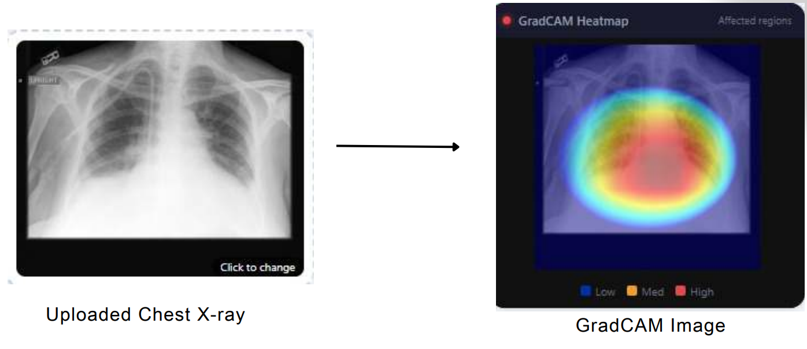
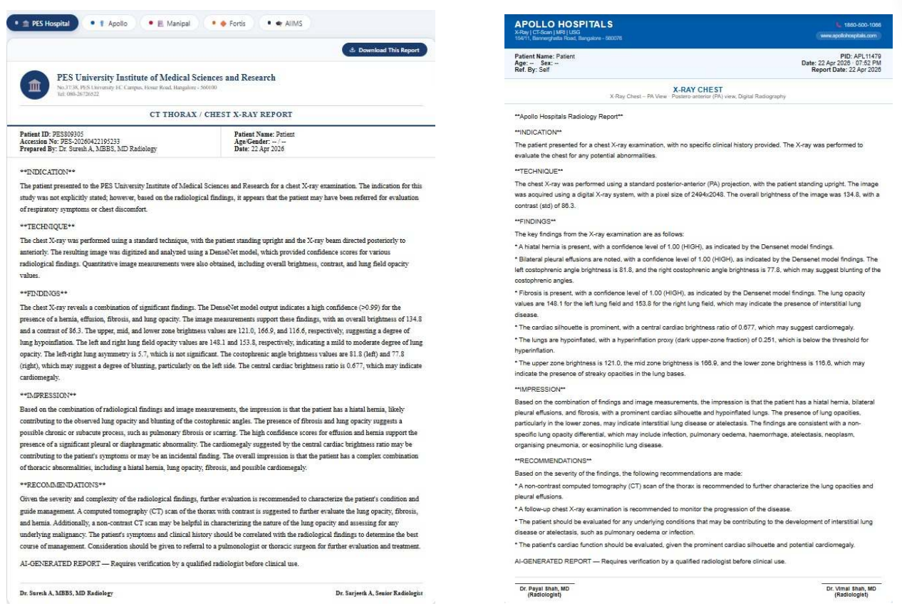

# Dr. ARIA — AI Chest X-ray Diagnosis System

Dr. ARIA (AI Radiology Intelligence Assistant) is a full-stack chest-X-ray report generation system. It takes a PA chest radiograph, runs an 18-class multi-label classifier, generates a Grad-CAM heatmap, retrieves relevant clinical knowledge from a ChromaDB vector store, and produces properly formatted radiology reports in the house style of five different hospitals using Groq LLaMA-3.3-70B.

---

## Stack

| Layer | Technology |
|---|---|
| Frontend | React 18 + Vite (port 5173) |
| Backend | Flask + Flask-CORS (port 5000) |
| Classifier | CXRResNet50 (ResNet50 backbone, 1-ch conv1, 18-class sigmoid head, Kaiming init) |
| Explainability | pytorch-grad-cam on `layer4[-1]` Bottleneck, elliptical anatomical mask |
| Retrieval | ChromaDB ephemeral client + `sentence-transformers/all-MiniLM-L6-v2` |
| LLM | Groq `llama-3.3-70b-versatile` |
| Datasets (RAG) | Curated corpus (~33 docs) + IU X-Ray (`ykumards/open-i`) + HF medical QA (`lavita/medical-qa-shared-task-v1-toy`, `medmcqa`, `pubmed_qa`) |

---

## Quick Start

### 1. Clone & set up secrets

```bash
git clone <your-repo-url>
cd <repo>
cp .env.example .env
# edit .env and paste your GROQ_API_KEY and HF_TOKEN
```

### 2. Backend

```bash
cd backend
python -m venv .venv
source .venv/bin/activate          # Windows: .venv\Scripts\activate
pip install -r requirements.txt
python app.py                      # starts Flask on http://localhost:5000
```

The first run downloads sentence-transformers weights and populates the in-memory ChromaDB. Expect 1–3 minutes.

### 3. Frontend (new terminal)

```bash
npm install
npm run dev                        # starts Vite on http://localhost:5173
```

Open http://localhost:5173.

---

## Environment Variables

Dr. ARIA reads secrets from a `.env` file in the repo root. Never commit this file — it is listed in `.gitignore`.

| Variable | Required | Description |
|---|---|---|
| `GROQ_API_KEY` | yes | Create at https://console.groq.com/keys |
| `GROQ_MODEL` | no | Defaults to `llama-3.3-70b-versatile` |
| `HF_TOKEN` | optional | Needed only for gated HuggingFace datasets (https://huggingface.co/settings/tokens) |

`backend/app.py` uses `python-dotenv` to load `.env` automatically. You can also `export` these variables in your shell.

---

## API Endpoints (Flask, `backend/app.py`)

| Method | Route | Purpose |
|---|---|---|
| POST | `/analyze` | Upload an X-ray + patient metadata → returns findings, GradCAM, 5 hospital reports, ML + NLG metrics |
| POST | `/chat` | Ask Dr. ARIA a follow-up question about the findings |
| POST | `/metrics` | Compute publication-style metrics for a given report/reference pair |
| GET | `/health` | Status probe + RAG corpus sizes |
| GET | `/metrics/summary` | Running mean/std/range of all per-image metrics (append `?reset=true` to clear) |
| POST | `/metrics/reset` | Clear the in-memory metric history |

---

## Project Structure

```
xray-aria/
├── .env                       # YOUR secrets — never committed
├── .env.example               # template — committed
├── .gitignore
├── README.md
├── index.html                 # Vite entry
├── package.json
├── package-lock.json
├── vite.config.js
├── indiana_projections.csv    # IU X-Ray reference projections (from HF dataset)
├── indiana_reports.csv        # IU X-Ray reference reports (from HF dataset)
├── src/
│   ├── main.jsx
│   ├── index.css
│   └── App.jsx                # Onboarding, 5 hospital report renderers, chat, analysis flow
└── backend/
    ├── app.py                 # Flask app, model, RAG, prompts, metrics
    ├── requirements.txt
    ├── evaluate.py            # batch evaluation harness — BLEU/ROUGE/METEOR/CIDEr/RadGraph
    └── eval_results_short/    # summary.csv + per_sample_metrics.csv from the last eval run
```

---

## Team — Division of Work

The system is cleanly split into three modules, one per team member. Each module has an owner but all three collaborate on integration.

### Module 1 — Classification + Explainability (Backend ML)
**Owner: Ruchitha**

- `CXRResNet50` architecture (ResNet50 backbone, 1-ch conv1, 18-class sigmoid head) in `backend/app.py`
- Multi-label ML metrics: accuracy, macro-F1, mean AUC-ROC, mAP, macro precision/recall — `compute_ml_metrics()`
- Grad-CAM heatmap generation with elliptical anatomical masking — `generate_heatmap()`
- X-ray input validator (`is_likely_xray`) — colour variance, contrast, histogram, aspect ratio checks
- Pixel-level image feature extraction (zone brightness, lung opacity, costophrenic angles, cardiac ratio) — `extract_image_features()`
- Confidence thresholding (HIGH ≥ 0.80, MODERATE 0.65–0.80)

### Module 2 — Retrieval + Report Generation + NLG Evaluation
**Owner: Renuka**

- Curated radiology knowledge base (~33 docs) in `backend/app.py`
- IU X-Ray RAG loader with `ykumards/open-i` primary + `ayyuce/...` fallback + built-in samples — `load_iu_xray_reports()`
- HuggingFace medical-QA loader (lavita, medmcqa, pubmed_qa) — `load_huggingface_datasets()`
- ChromaDB ingestion + `all-MiniLM-L6-v2` embeddings, retrieval pipeline — `retrieve_knowledge()`
- Groq LLaMA-3.3-70B prompt engineering — `ARIA_SYSTEM_PROMPT`, `build_groq_report()`, `/chat` route
- 5 hospital templates + style metadata (`HOSPITAL_META` — PES, Apollo, Manipal, Fortis, AIIMS)
- Doctor / Patient audience modes
- Publication-standard NLG metrics: BLEU-1/2/3/4, ROUGE-1/2/L, METEOR, CIDEr, RadGraph F1, cosine similarity, faithfulness, context relevance, hallucination risk

### Module 3 — Frontend + Integration
**Owner: Rama Anjali**

- React UI (`src/App.jsx`, `src/main.jsx`, `src/index.css`, `index.html`)
- Six-step onboarding flow (`Onboarding` component)
- Image upload with drag-and-drop + patient metadata form
- Five hospital-specific report renderers (`PESReport`, `ApolloReport`, `ManipalReport`, `FortisReport`, `AIIMSReport`) — each in the real hospital's visual style
- Grad-CAM heatmap display + legend
- Detected-condition chips + error panel for rejected images
- Dr. ARIA chat panel (`ChatPanel`) with suggested questions and typing indicator
- Flask ↔ React wiring (`/analyze`, `/chat`, `/health` fetches)
- Per-hospital and bulk report download (plain text)

---

## Screenshots

**Analysis output** — uploaded X-ray with Grad-CAM heatmap


**Hospital-specific report rendering**


## How the `/analyze` pipeline fits together

```
PNG/JPG upload
    ↓
is_likely_xray()           → reject if not a chest X-ray
    ↓
extract_image_features()   → brightness zones, lung opacities, costophrenic angles, cardiac ratio
    ↓
CXRResNet50 forward pass   → 18 sigmoid scores ∈ [0,1]
    ↓
get_findings()             → top findings above 0.65 threshold
    ↓
compute_ml_metrics()       → macro F1, AUC, mAP, precision, recall
    ↓
retrieve_knowledge()       → ChromaDB top-8 relevant docs
    ↓
generate_heatmap()         → Grad-CAM on layer4[-1] with elliptical lung mask
    ↓
build_groq_report() × 5    → Groq LLaMA-3.3-70B renders PES / Apollo / Manipal / Fortis / AIIMS reports
    ↓
compute_all_metrics() × 5  → BLEU, ROUGE, METEOR, CIDEr, RadGraph F1 (averaged across hospitals)
    ↓
JSON response → React renders all 5 hospital views, heatmap, chips, chat
```

---

## Notes for graders / reviewers

- All reports end with: *"AI-GENERATED REPORT — Requires verification by a qualified radiologist before clinical use."*
- The RAG knowledge base is rebuilt in memory on every Flask startup (ChromaDB `EphemeralClient`). Expect a short warm-up on first request.

---

## Safety

- `backend/eval_results/` contains only metrics, no patient data.
- The application is for research and educational use only — it does not replace a radiologist's judgement.
